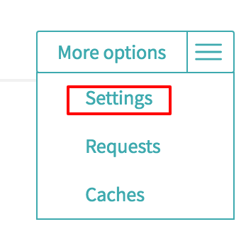

How it's working?
=================
After each successful build of the binaries a new Debian package is being generated (with an updated changelog based on 
the git commit messages and authors).
That package is being uploaded to GitHub as a release asset. The target release is named exactly the same as the 
tag of the current version. If such a release does not yet exist, it will get automatically created.

IMPORTANT: in the case when a release asset with the exact same name already exists (we're for example doing a rebuild), 
it will get replaced with the newly generated file.

How to configure Travis and GitHub?
===================================
Before you can start building the Debian packages, you'll have to configure GitHub and Travis accordingly.

GitHub
------
1. Log in to your (or for that matter - any valid / selected) GitHub account and go to "Settings / Personal access tokens"
2. Generate a new token that has read/create/edit/delete permissions to your project's releases
3. Store the token somewhere as you won't get a second chance to do that

After doing that you should have two things prepared and ready:
1. a GitHub username (the one of the account you have used to generate the new token)
2. a GitHub token

Now you're ready to configure Travis.

Travis
------
1. Log in to your Travis account and add the project's repository to Travis the same way you would do with any other project
2. Go to your project's option menu and select "Settings":

3. Scroll down to the "Environment Variables" section and add two new variables that will be used to access the GitHub
repository of the project:
  GITHUB_LOGIN which value should be set to the username/login of the GitHub account used previously
  GITHUB_TOKEN which value should be set to that of the token you have recently created
Make both variables secret ones - we don't want to show them to anyone (especially the token):

Voila! That should be enough for the scripts to be able to manage the releases of your project (including the assets 
related to a specific release).
